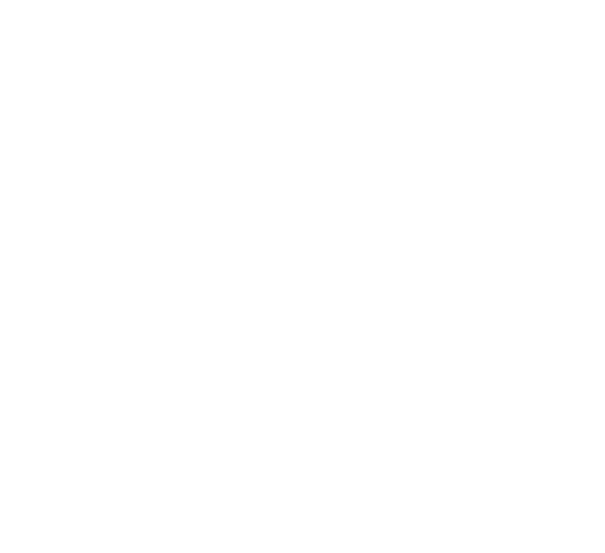
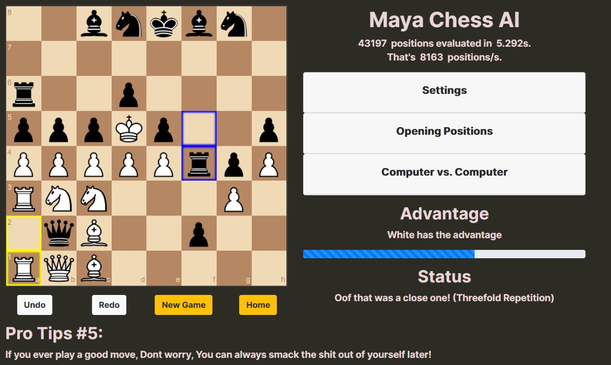

## Inspiration
The authors of this project were inspired by great men such as ― Bernard Kelvin Clive and Mahatma Gandhi. Mahatma Gandhi advocated <b>non-violence</b> and Bernard Kelvin Clive once said  <h3>“Don't be indifferent be the difference - Standout!”. </h3>
It is safe to say the authors took their ideals very seriously.  
The global pandemic has lead to a big online chess boom. With large parts of the population in lockdown, chess has become a popular pastime and coping mechanism. Chess.com, a social network and chess server website, has added around 1 million new members each month since the lockdowns began in March, and around 2.8 million in November alone. In the same month, over 78 million standard chess games took place on lichess, a free online chess server, compared to half as many in November 2019. Chess is on its way to become one of the most popular sports as we see millions of people join these online platforms to <b>improve </b>their play.
<h3> This isn't good. </h3>
<h4> People must realise this is the exact <b>opposite</b> of <b>standing out</b> from the crowd  </h4>

## Solution
The authors spent plenty of time (7 mins to be precise) in designing the solution. We are proud to present to you Maya, A chess engine that helps you get terrible at the game by playing the absolute worse moves.
In a world where people are trying to get better at the game. Stand out by working to play the game nastily .
## About
 

The primary concern of chess-ai is the decision-making part of the application. All functionality outside the scope of the AI are implemented using external libraries:
- Chessboard GUI: Using the chessboard.js API
- Game Mechanics: Using the chess.js API

The AI uses a modified version of the [minimax algorithm](https://en.wikipedia.org/wiki/Minimax), which is optimised by [alpha-beta pruning](https://en.wikipedia.org/wiki/Alpha%E2%80%93beta_pruning). It wouldn't really be fair to call it minimax algorithm anymore, a more apt-name would be <b>minmin algorithm</b> .

The evaluation function uses [piece square tables](https://www.chessprogramming.org/Piece-Square_Tables) adapted from Sunfish.py, and eliminates the need for nested loops by updating the sum based on each move instead of re-computing the sum of individual pieces at each leaf node.

A global sum is used to keep track of black's evaluation score after each move, which is used to display the 'advantage' bar. 

## How to Play?
1. Head over to https://mayachess.herokuapp.com/ .

2. Play as white by dragging a piece to your desired location. The AI plays as black. The AI's minimax search depth (which is directly related to how <b>bad</b> it will play) can be customised using the 'Search Depth (Black)' dropdown. Using a higher value will improve the AI's accuracy, but it will take longer to decide on the next move.

3. To pit the AI against itself, click the 'Start Game' button under Computer vs. Computer. You can stop the game at any time using the 'Stop and Reset' button.

<h3>Parody project built for fun XD</h3>

## Acknowledgement/References
1. Wikipedia.com for the chess pieces
2. https://www.freecodecamp.org/news/simple-chess-ai-step-by-step-1d55a9266977/
3. https://www.thechesswebsite.com/chess-openings/
4. https://github.com/geohot/twitchchess
5. https://github.com/zeyu2001/chess-ai
6. https://en.wikipedia.org/wiki/Minimax
7. https://en.wikipedia.org/wiki/Alpha%E2%80%93beta_pruning
8. https://www.chessprogramming.org/Piece-Square_Tables

## License
Use of this project is governed by the [MIT License](LICENSE).  
Special thanks to all our supporters <3:  

